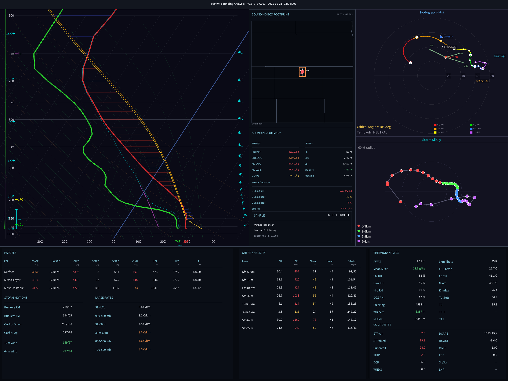

# sharprs

Rust sounding analysis and rendering.

`sharprs` is a standalone Rust crate for working with atmospheric soundings. It reads a vertical profile, computes common severe-weather diagnostics, and renders a Skew-T/log-P + hodograph + parameter-table PNG without Python or matplotlib.

<p align="center">
  
</p>

The example above is an HRRR box-mean profile from the Enderlin, ND tornado archive workflow. The renderer itself only needs a profile: pressure, height, temperature, dewpoint, and wind.

## What It Does

- Parses CSV, SHARPpy raw text, and University of Wyoming sounding text.
- Computes parcel, wind, shear, helicity, lapse-rate, moisture, fire-weather, and severe composite diagnostics.
- Renders a native PNG with Skew-T/log-P, hodograph, storm slinky, wind barbs, parcel traces, CAPE/CIN shading, and a dense parameter table.
- Provides a Rust library API and a small CLI renderer.
- Has optional Python bindings behind the `python` feature.

## CLI

```bash
cargo run --release --bin sharprs-render -- sounding.csv output.png
```

Expected CSV columns:

```text
PRES,HGHT,TMPC,DWPC,WDIR,WSPD
```

## Rust API

```rust
use sharprs::profile::Profile;
use sharprs::render::{compute_all_params, render_full_sounding};

let profile = Profile::from_csv("sounding.csv")?;
let params = compute_all_params(&profile);
let png = render_full_sounding(&profile, &params);

std::fs::write("sounding.png", png)?;
```

## Python Bindings

```bash
pip install maturin
maturin develop --features python
```

The Python bindings are optional. The core analysis and renderer are Rust.

## Diagnostics

`sharprs` includes routines for:

- CAPE, CIN, LCL, LFC, EL, DCAPE, and effective inflow layer diagnostics
- Bunkers and Corfidi storm motions
- storm-relative helicity, bulk shear, mean wind, and critical angle
- STP, SCP, SHIP, SHERB, EHI, DCP, WNDG, ESP, MMP, and related composites
- K index, total totals, precipitable water, lapse rates, mean RH, mean mixing ratio, wet-bulb zero, freezing level, and DGZ/HGZ helpers
- Fosberg Fire Weather Index and Haines Index

The crate aims to make calculations explicit and inspectable. It should not be treated as a magic storm classifier; downstream applications should label their data sources and verification separately.

## Rendering

The native renderer produces a 2400 x 1800 PNG. The current layout emphasizes readability:

- large Skew-T/log-P panel
- separate hodograph
- enlarged storm slinky panel
- compact locator/summary area for application-supplied metadata
- full-width parameter table

Rendering uses a software rasterizer with antialiased lines, alpha blending, bitmap text, and native wind-barb drawing. It does not require a GPU, Python, matplotlib, or external font files.

## Development

```bash
cargo test
```

The test suite covers thermodynamic functions, interpolation, wind calculations, severe composite formulas, rendering primitives, and real-sounding smoke tests.

## Project Layout

```text
src/
  constants.rs
  error.rs
  thermo.rs
  interp.rs
  utils.rs
  winds.rs
  profile.rs
  fire.rs
  watch_type.rs
  params/
  render/
  python.rs
  main.rs
  lib.rs
```

## License

See [LICENSE](LICENSE).
